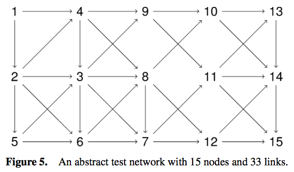
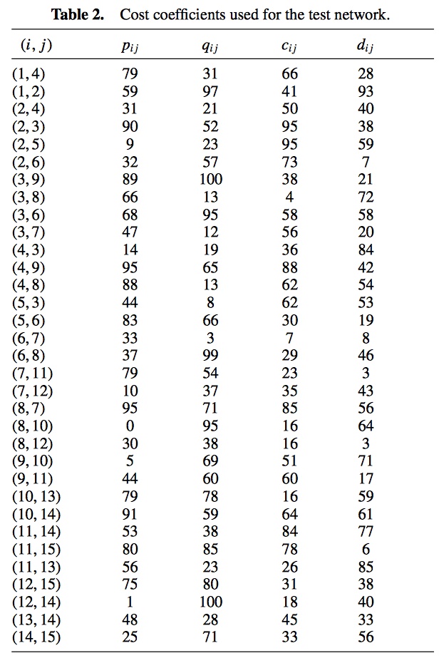

# RobustShortestPath.jl

[](https://travis-ci.org/chkwon/RobustShortestPath.jl)
[](https://coveralls.io/r/chkwon/RobustShortestPath.jl)

Robust Shortest Path Finder for [the Julia Language](http://julialang.org).

This package provides functions to find robust shortest paths. Please see the reference papers below.

<!--
# get_shortest_path

This provides an interface to Dijkstra's method from the [Graphs.jl](https://github.com/JuliaLang/Graphs.jl) package.
-->
# Install

```julia
julia> Pkg.add("RobustShortestPath")
```

This will also install [Graphs.jl](https://github.com/JuliaLang/Graphs.jl), if you don't have it installed in your Julia system already.

To check if works
```julia
julia> Pkg.test("RobustShortestPath")
```

# get_robust_path

This function solves the robust shortest path problem proposed by Bertsimas and Sim (2003) and integrates the idea of Lee and Kwon (2014).


- [Bertsimas, D., & Sim, M. (2003). Robust discrete optimization and network flows. Mathematical programming, 98(1-3), 49-71.](http://link.springer.com/article/10.1007/s10107-003-0396-4)

- [Lee, T., & Kwon, C. (2014). A short note on the robust combinatorial optimization problems with cardinality constrained uncertainty. 4OR, 12(4), 373-378.](http://link.springer.com/article/10.1007/s10288-014-0270-7)

# get_robust_path_two

This function solves the robust shortest path problem with two multiplicative uncertain cost coefficients proposed by Kwon et al. (2013).

- [Kwon, C., Lee, T., & Berglund, P. (2013). Robust shortest path problems with two uncertain multiplicative cost coefficients. Naval Research Logistics (NRL), 60(5), 375-394.](http://onlinelibrary.wiley.com/doi/10.1002/nav.21540/full)


# Example

Example network and data from [Kwon et al. (2013)](http://onlinelibrary.wiley.com/doi/10.1002/nav.21540/full):





The above network data should be prepared in the column vector form as follows:
```julia
data = [
 1   4  79   31  66  28;
 1   2  59   97  41  93;
 2   4  31   21  50  40;
 2   3  90   52  95  38;
 2   5   9   23  95  59;
 2   6  32   57  73   7;
 3   9  89  100  38  21;
 3   8  66   13   4  72;
 3   6  68   95  58  58;
 3   7  47   12  56  20;
 4   3  14   19  36  84;
 4   9  95   65  88  42;
 4   8  88   13  62  54;
 5   3  44    8  62  53;
 5   6  83   66  30  19;
 6   7  33    3   7   8;
 6   8  37   99  29  46;
 7  11  79   54  23   3;
 7  12  10   37  35  43;
 8   7  95   71  85  56;
 8  10   0   95  16  64;
 8  12  30   38  16   3;
 9  10   5   69  51  71;
 9  11  44   60  60  17;
10  13  79   78  16  59;
10  14  91   59  64  61;
11  14  53   38  84  77;
11  15  80   85  78   6;
11  13  56   23  26  85;
12  15  75   80  31  38;
12  14   1  100  18  40;
13  14  48   28  45  33;
14  15  25   71  33  56;
]

start_node = data[:,1] #first column of data
end_node = data[:,2] #second column of data
p = data[:,3] #third
q = data[:,4] #fourth
c = data[:,5] #fifth
d = data[:,6] #sixth
```

For a single-coefficient case as in [Bertsimas and Sim (2003)](http://link.springer.com/article/10.1007/s10107-003-0396-4):
```julia
using RobustShortestPath
Gamma=3
origin=1
destination=15
(robust_path, robust_x) = get_robust_path(start_node, end_node, c, d, Gamma, origin, destination)
```
The result will look like:
```julia
([1,4,8,12,15],[1,0,0,0,0,0,0,0,0,0  …  0,0,0,0,0,0,1,0,0,0])
```

For a two-coefficient case as in [Kwon et al. (2013)](http://onlinelibrary.wiley.com/doi/10.1002/nav.21540/full):
```julia
using RobustShortestPath
Gamma_u=2
Gamma_v=3
origin=1
destination=15
(robust_path, robust_x, worst_case_cost) = get_robust_path_two(start_node, end_node, p, q, c, d, Gamma_u, Gamma_v, origin, destination)
```
The result should look like:
```julia
([1,4,3,7,12,14,15],[1,0,0,0,0,0,0,0,0,1  …  0,0,0,0,0,0,0,1,0,1],25314.0)
```

See [runtest.jl](https://github.com/chkwon/RobustShortestPath.jl/blob/master/test/runtests.jl) for more information.


# Contributor
This package is written and maintained by [Changhyun Kwon](http://www.chkwon.net).
